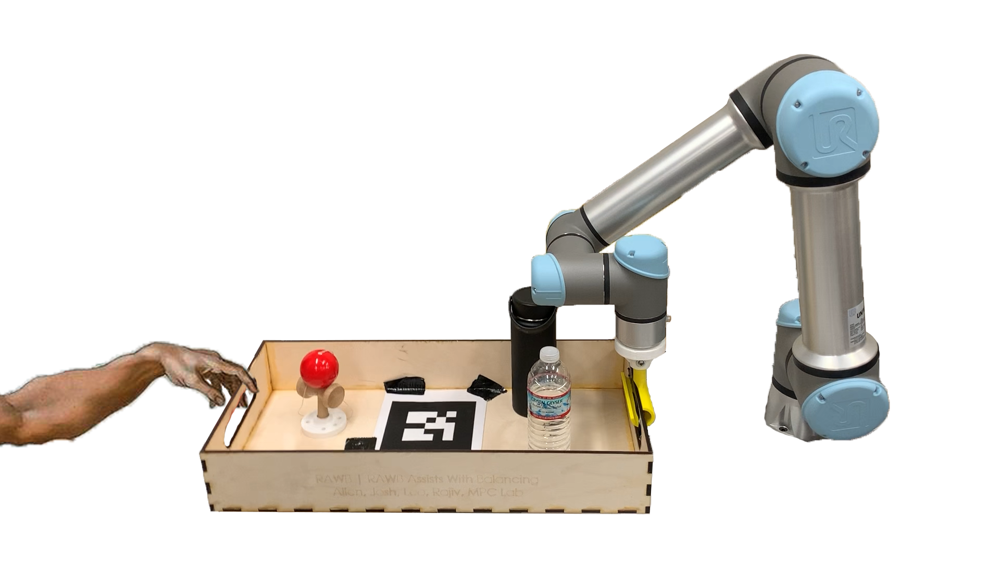
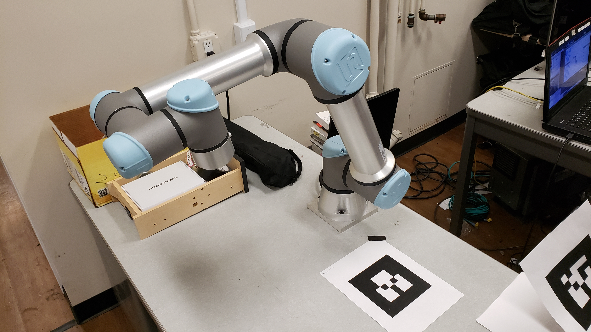
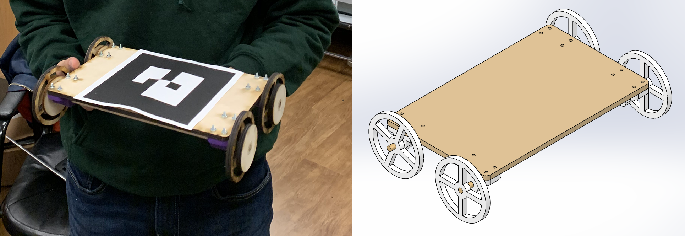
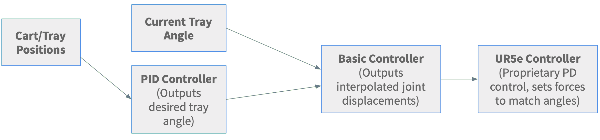
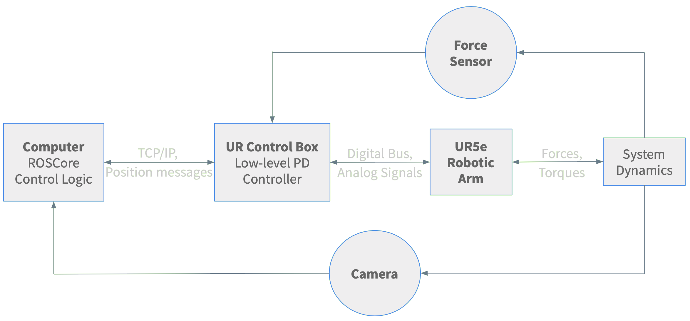
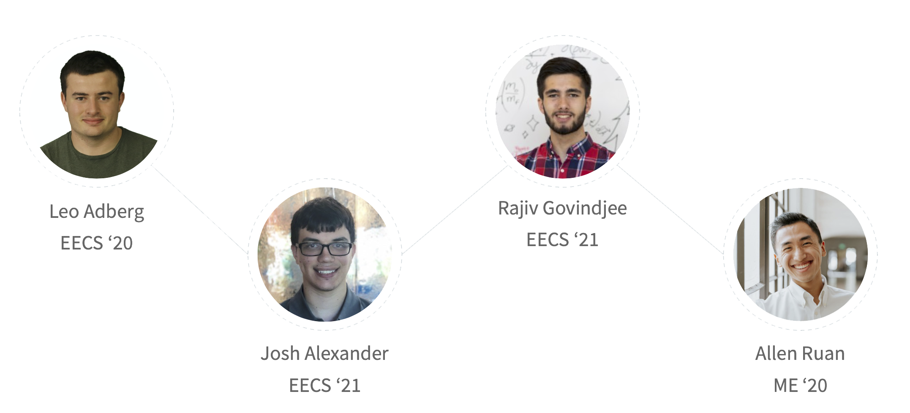

# Introduction

The continued growth in collaborative efforts between humans and robots has a multitude of applications ranging from domestic household tasks to serious industrial challenges. These tasks are currently performed by two or more humans, as it is generally not safe to enter the reachable workspace of a multi-ton industrial robot. For example, common human-human collaboration tasks might include two humans trying to move a heavy object (say, a <a href="https://en.wikipedia.org/wiki/Moving_sofa_problem">sofa</a> or table) together in a cluttered environment, or several technicians working together to place a large panel precisely onto a car on the assembly line. 

When it comes to designing robots to substitute for one of the humans in these tasks, the challenges are many-fold. While humans have a whole suite of force feedback sensors, many degrees of freedom, a vision system, and the ability to communicate over speech, these features are all significantly more difficult to implement on robots, let alone integrate into one package. That being said, robots that collaborate with humans (also known as cobots) offer the ability to go beyond what two humans would be able to do; cobots can move quickly, precisely, and, most importantly, safely bear far greater loads than humans can. As such, human-robot interaction (HRI) continues to be an exciting and promising field of research.

Our project, RAWB, aims to delve specifically into the sub-field of responsive collaboration, where feedback between both parties is exchanged in real time. Specifically, our primary objective is to be able to comfortably balance a static object in a tray suspended on one end by a human and on the other by a robotic arm in 3 degrees of freedom (DOF). Interaction with the robot should be natural and predictable, just as if another human were on the other end.

 

# Design

### Criteria and Functionality

RAWB's desired functionality is to make lifting the tray as easy and intuitive as possible while keeping the contents of the tray stable. When designing RAWB, our criteria were that it had to take relatively minute sensor inputs and output perfectly chosen actions to keep the tray and its contents steady. Due to the constantly changing human input, the robot will have to do this hundreds of times per second. Most important is that the human in the system feels the robot is acting in a helpful, intuitive manner.

In terms of hardware design, we wanted to make our end effectors modular and easy to attach/detach from the robot in order to test different control approaches and iterate on design. We required all end effectors to have some degree of underactuation in order to make interaction with the robot more natural, as well as protect the end effectors themselves; the low-cost materials available to us lacked the ability to withstand large forces and moments in some directions.

### Description

Our design can be split into sensing, actuation, and control.

The chosen sensing architecture consists of a force sensor and camera, as well as state feedback from the robot. 
We required a 6-DOF robotic arm to perform the actuation--we chose the Universal Robotics 5e (UR5e) robotic arm for this purpose (more on this below). On the student-designed side, we settled on a non-rigid chain attachment for coupling to the tray, as well as a more rigid C-shaped end effector. 
For control design, we chose a cascade of PID controllers from high- to low-level to actuate the robot. For pictures and diagrams, see the Implementation section below.

### Decisions

We settled on using both AR tag input from a USB camera and the force sensor on the end effector of the robot for sensor input. The force sensor allows us to detect forces from the hand in axes that are rigidly attached to the robot and thus wouldn't be detectable by viewing the system. The AR tags allow us to detect motion of the tray in axes that are not rigidly attached to the robot and thus can't easily be detected by the force sensor. 

We briefly considered more advanced computer vision, but it was decided that the focus of our project was the control and human-robot interaction component, not object detection/pose estimation. That being said, it is definitely possible to remove the AR tags and use a more complex CV stack. We also weighed the compute time and power required for some image processing; as seen in the Implementation section, image processing and the camera frame rate put significant limitations on our control design.

When choosing the arm, we prioritized both access to hardware as well as the reliability/capability of the hardware. PhD student Tony Zheng, working in Professor Francesco Borelli's Model Predictive Control (MPC) lab, was generous enough to offer us access to a <a href="https://www.universal-robots.com/products/ur5-robot/">UR5e 6-DOF arm</a> there. We also considered using the Baxters or Sawyers in lab, but decided that the benefits of familiarity would be outweighed by the constant hardware issues and having to compete for robot time with other groups.
This proved to be a good decision, as we were able to work with our hardware for entire days leading up to the presentation date, with little setup or teardown. The UR5e is specifically designed to be a cobot, with safety features like automatic shutdown on high joint loads to prevent it from harming humans or itself.

For interacting with the environment, we designed two attachments from the tray to the robot: a rigid clamp that constrains the tray in every axis but pitch, and a loose chain attachment that lets the tray move freely. The implementation of these attachments in described later, but each has benefits and drawbacks with respect to the rest of the design choices we made. Both attachments worked, but we settled on the chain attachment for most of our tests because the freedom it allows the human is nicer and more realistic in a real-world use case.

The robot's control systems were an interesting problem. The UR5e arm takes in joint angles and uses a proprietary low-level PD controller to move the arm to those angles as fast as it can. We designed a basic higher level controller to keep the arm's motion slow, smooth, and bounded within a certain region. On top of that, we have a high level PID controller that takes in sensor inputs and outputs a desired correction velocity.

### Analysis

We believe we have chosen the best design for our real-world problem space. Our system is proven safe by the controllers we use, durable due to the strong but flexible attachment used and industrial-strength robot arm, and robust due to the sensor inputs we picked which work no matter what object the robot is carrying or its physical characteristics. Based off playing with the completed design, we can say that RAWB is pretty efficient and fun to use.

 

# Implementation

### Hardware

Our hardware was a mix of borrowed materials from Professor Francesco Borrelli’s Model Predictive Control (MPC) lab and custom-designed and manufactured in the Jacobs and CITRIS Invention Lab Makerspaces. The Universal Robotics (UR5e) robotic arm, and camera, was lent to us from the MPC lab. 

On the other hand, we designed and lasercut the tray and cart out of plywood and 3D-printed the two end-effectors and end-effector mount for the arm on the Ultimaker 3D Printers in the CITRIS Invention Lab. We designed two end-effectors with the intent of testing both a rigid C-gripper and a flexible, and as a result, underactuated, chain-link design.

For one of our stretch goals, we designed and built a small cart to sit on the tray and roll back and forth. The manufactured cart is shown below.

### Software

Prior to working with the MPC UR5e equipment directly, we worked with the simulation software MuJoCo and URSim to plan how the robot would interact with the world safely. We took a URDF of the UR5e robotic arm and created an MJCF of the arm, end effector mount and tray mechanism, and a representation of a person who could move the tray along two axes.  After a few tests in MuJoCo, we switched over to the URSim simulation environment. URSim was used heavily to verify the output of our controllers in simulation using real data gathered from the camera throughout the project.  This simulation environment allowed us to detect when errors occurred in the robot’s path such as a joint trying to travel an extra revolution in a direction before arriving at the configuration we requested.  This issue would arise due to the robot’s joint’s ability to move in a range from $[-2\pi, 2\pi]$ to allow easy motion around the boundaries of the range $[-\pi, \pi]$. However, we originally failed to account for the fact that one of the robot’s joints may start out close to $2\pi$ away from the orientation desired.

Our ROS setup consists of:

- A custom RAWB node
  - Written in Python
  - Communicates with the UR5e controller over TCP/IP
  - Uses ur_kinematics (included in ROS-Industrial) to perform forward and inverse kinematics of the UR5e arm
  - TF functions are also used inside the node to perform transformations
- Intel RealSense node
  - We only use the 2D camera, it was simply what was available in the MPC lab
- The ar_track_alvar node as used in lab4
- rviz to view the AR tags

The design of the RAWB is shown in the flowchart above, but there are small variations depending on the version used (e.g. 3DOF, 4DOF, Balancing). Each cycle of the control loop, the node reads the current joint state from the robot, the current forces on the end effector, and the AR tag input. Each sensor input is added into an exponentially decaying moving average, which essentially functions as a low-pass filter; this was especially effective for the force sensor feedback.

The basic 3DOF control logic is as follows:

- RAWB uses the pitch of the AR tag on the tray to detect a vertical offset between the human hand and the gripper and tries to correct it accordingly by moving the Z axis of the end effector. The force sensor is not used here because although it is possible to detect pitch through force in the Z axis, it requires precise calibration and is incredibly noisy.
- RAWB uses the yaw of the AR tag to detect the human moving the tray side-to-side and outputs a clamped velocity in the Y direction proportional to the yaw. We also used the force sensor to detect a yaw, but this doesn't work well with the non-rigid attachment so we chose AR inputs to be more versatile.
- RAWB uses the force sensor in the X axis and outputs a corresponding velocity in the X direction. We chose a force input instead of an AR input because with the rigid attachment, applying a force in the X direction (towards the gripper) wouldn't result in any actual translation and therefore no visible different to pick up on.

The balancing controller extends the control of the tray pitch:

- The PID controller now takes as input the position of the cart relative to the center of the tray.
- The output is a desired tray angle that will exert a force to move the cart to the center (and flat if the cart is already in the middle, obviously).

This does not work perfectly yet due to a few reasons:

- First, the AR tracking library loses track of the cart when it reaches any reasonable speed, causing the controller to fail.
- Second, we have imposed hard speed limits for safety using the "basic controller", which causes the cart to overshoot the middle almost every time.
  - This occurs because the angle required to overcome friction when the cart is at one end is too high to return to flat by the time the cart has reached the middle, and so it usually oscillates forever.
  - The arm itself can move very fast so lifting the speed limits might solve some issues, but we weren't comfortable with it.

One of the problems with 4DOF is that our system only has 3 inputs in the ideal model, so a 4DOF mode should be impossible. Our ideal model only allows the human hand to put a force on a point, and therefore they cannot torque the tray relative to their hand. They can only push it in X/Y/Z, so how does our system have 4 independent outputs using only 3 inputs?

We cheat a bit by separating into two modes: 3DOF and 1DOF.

- The 3DOF mode is largely the same as described above with the addition that the tray is not set at angle 0, but possibly any arbitrary angle.
- The 1DOF controller allows the human to rotate the tray easily by moving it about its center of mass.
   - The robot always keeps the center of the tray (defined by the AR tag) in the spot but rotates the other end around it to counteract the human's movement.
   - It would have been trivial to keep the gripper fixed in 1DOF mode and simply let the human do all the rotation, but using RAWB's movement to fix the center of the tray instead is a much more interesting problem (not to mention much cooler visually).

Switching modes is still an interesting problem. As our goal is for the robot to assist the human in carrying, the human cannot press a button on the computer to switch modes because it would be out of reach. Instead, the human knocks on the tray they're carrying and RAWB's force sensors detect the knock, switching modes and playing a chime to confirm the switch.

### Overview

The camera outputs an image at 30 Hz of the entire system with the AR tags in view. The computer is running roscore for the entire system and takes in these images, locates the position and orientation of the AR tags, and attaches coordinate frames to the center of them. The control logic calculates how much the body frame of the tray AR tag has rotated in both the pitch and the yaw of the frame of the table AR tag. It also finds the translational distance along the Y-axis of the frame of the tray AR tag that the cart AR tag has moved when it is trying to balance the cart. The control logic incorporates this information, in addition to information about the force at the end effector in the X-axis of the table AR tag's frame, to find a desired location to move the end of the UR5e arm to balance the tray, or move the cart, and compute the joint angles from inverse kinematics necessary to achieve this position. When solving the cart balancing problem, the outputs from the sensor and AR tracker readings first are sent into a PID controller in order to improve the ability of the cart to reach the middle of the tray faster.

These joint angle adjustments are sent over TCP/IP to the UR control box which will directly communicate with the robot. The UR control box is a low-level PD controller that converts desired joint angles received over its Real Time Data Exchange interface into commands that tell the arm how to move. The control box communicates with the arm using a digital bus and analog signals. The robotic arm receives those commands from the UR control box and moves to the correct configuration and changing the forces and torques in the system dynamics as a whole. The camera and the force sensor proceed to pick up on these modifications, and the whole process begins anew.

While this description explicitly references the 3DOF and cart balancing problems, it functions nearly identically for the 4DOF problem only adding the ability to switch what AR tag behavior is measured and the desired location of the end effector of the robot when a knock is detected by the force sensor all within the control logic.

 

# Results

### 3DOF (Main Goal)

Works perfectly!



 

### Cart Balancing

Needs more tuning and possibly better sensors (or AR libraries).

Here is an example of it working in easy conditions:



 

Oscillation:



 

Tracking Failure:



 

### 4DOF

Works well! Watch with audio to hear the chimes.

- In the video at 48s you can see the one failure: it changes modes when moving too fast vertically. Vertical movement adds a ton of noise to the force sensor in the Z axis so it's hard to differentiate movement and knocks.
- As you can see, Leo double-presses the tray instead of knocking. This is due to the fact that a knock is such a short duration (in the ms) that it can be missed entirely in between force sensor readings, and is therefore a bit unreliable.



 

# Conclusion

RAWB has been, in short, a success. Not only did we meet our goal of balancing objects in 3DOF, we also met a few of our stretch goals including balancing rolling objects (a cart) and a 4DOF mode. 

However, along the path we did run into a variety of obstacles. With regard to the arm itself, there were a plethora of singularities in the arm’s reachable workspace that often resulted in sharp jerky movements. In addition, there was an extremely steep learning curve regarding picking up the two simulation environments, MuJoCo and URSim, both of which none of us had used before. Furthermore, the simulation environments were often unable to capture our entire hybrid sensing system (for example, there was no force sensing in URSim). Finally, due to the shared manufacturing spaces with other student groups, there was a slight bottleneck with manufacturing lead time.

As a result, we would still like to iterate and improve upon our current progress. In particular, given that we used a standard PID controller, it would be interesting to see how a more optimal LQR or MPC controller would fare in our real-time reference tracking mode. As one of our greatest challenges was obtaining reliable state feedback , a Luenberger observer or Kalman filter might help us overcome our difficulties with AR tags and camera sampling rate.

In addition, balancing a ball instead of a cart would prove to be a much more challenging problem, given that we would have to incorporate a bit more vision-based sensing (e.g. thresholding, etc.). Finally, it would also be interesting to see if we could incorporate avoidance of simulated or physical obstacles in the workspace to improve the robustness of our project. Together, these facets would allow us to further demonstrate the novel and practical application of RAWB.

 

# Team

[Leo Adberg](http://leo.adberg.com) is a senior EECS major. Leo's main focus is in software but in high school he participated in VEX and FRC robotics. Leo wrote most of the control code for RAWB.

Josh Alexander is a junior EECS major. Josh also participated in VEX Robotics in high school. He mostly focused on designing the framework for the simulation of RAWB and manufacturing the hardware used.

[Rajiv Govindjee](http://ocf.io/rgovindjee) is a junior EECS major with a MechE minor. Rajiv worked on control design and overall system architecture as well as the design and manufacturing of hardware components.

Allen Ruan is a senior ME major. Allen's primary role was designing and manufacturing the hardware necessary for RAWB. 

 

# Additional Materials

All code is located [here](https://github.com/leoadberg/EECS106A_Project/)

[URDF](https://github.com/leoadberg/EECS106A_Project/blob/master/mac_sim/model/UR5_URDF.xml)
[MJCF](https://github.com/leoadberg/EECS106A_Project/blob/master/mac_sim/model/UR5_106A.xml)

[All CAD models](https://github.com/leoadberg/EECS106A_Project/tree/master/cad)

[UR 5e User Manual](https://s3-eu-west-1.amazonaws.com/ur-support-site/61611/99404_UR5e_User_Manual_en_Global.pdf)

### Extra Videos

3DOF hybrid working with the rigid "C" gripper.



 

Here is what the first attempt at incorporating force sensor data looks like. Think of it like a more advanced gravity compensation mode.



 

3DOF hybrid with long chain.



 

One of our first 1DOF attempts.



 

Our first 2DOF attempts.




 

At attempt at 3DOF using purely force sensors, which didn't work well because we couldn't calibrate the Z axis well enough.



 

Example of running a test on URSim before hardware. This is showing that the arm cannot extend past the virtual bounds we have set.

